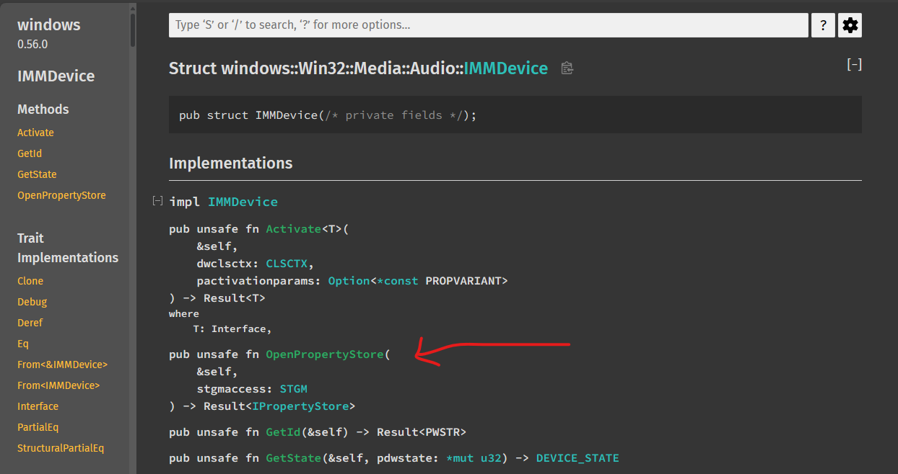
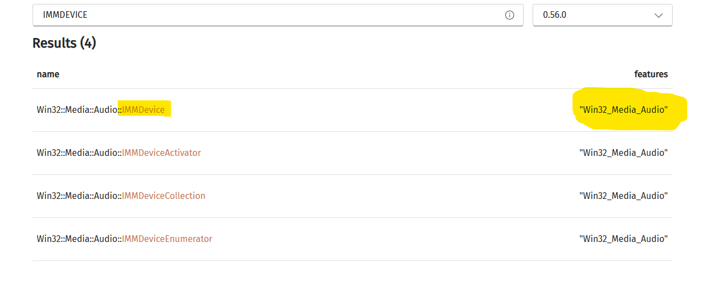
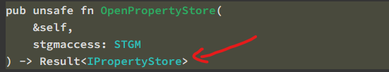
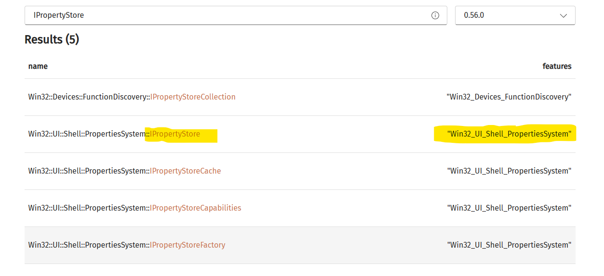

#Common Issues with Feature Flags

Working with the Rust Apis can be a bit challenging at the moment as you must 
constantly refer to the [Cpp documentation](https://learn.microsoft.com/en-us/windows/win32/coreaudio/core-audio-apis-in-windows-vista) to infer usage, flags, etc.

Additionally, the feature flags for modules can only be found by
searching the particular Struct, Trait, etc. at the following location:

[Rust Docs](https://microsoft.github.io/windows-docs-rs/doc/windows/index.html)
[Feature Flag Search](https://microsoft.github.io/windows-rs/features/#/0.56.0)

For example, it leads to the following:
```rust
use windows::{
    core::*,
    Win32::{Media::Audio::*, System::Com::*},
};

fn main() -> windows::core::Result<()> {
    unsafe {
        CoInitializeEx(None, COINIT_MULTITHREADED).ok()?;
        let device: IMMDevice = get_output_device()?;
        let property_store = device.OpenPropertyStore(STGM_READ)?; // OpenPropertyStore not a method on IAudioClient 
        let format = property_store.GetValue(&PKEY_AudioEngine_DeviceFormat as *const _)?;
        let name = property_store.GetValue(&PKEY_Device_FriendlyName as *const _)?;
        let name = name.to_string();
        let format = format.to_string();
        println!("device name: {}", &name);
        println!("device format: {}", &format);
    }
    Ok(())
}
```

But wait, it is there?



Let's recheck the features for IMMDevice...



Well, I definitely already added the Win32_Media_Audio feature in Cargo.toml.
Hmm... Doublecheck the docs?



Ah, I didn't check the feature flags for IPropertyStore



```
cargo add windows --features Win32_UI_Shell_PropertiesSystem
```

Aaaand... it works.

```rust
use windows::{...};
fn main() -> windows::core::Result<()> {
    unsafe {
        CoInitializeEx(None, COINIT_MULTITHREADED).ok()?;
        let device: IMMDevice = get_output_device()?;
        let property_store = device.OpenPropertyStore(STGM_READ)?; // OpenPropertyStore works now
        ...
```


It's not a very big deal one you've caught it, but if something doesn't make sense. Be sure to check the features
for the return types, traits, etc. 
